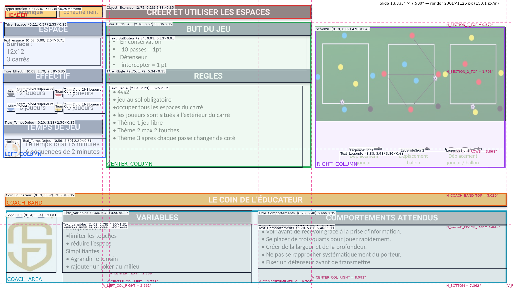

# Analyse du template « TemplateSeance.pptx »

Source : `fixtures/TemplateSeance.pptx` (1 diapositive, PowerPoint 16.0).
Toutes les mesures proviennent du XML (`tools/dump_slide.py` → `output/raw_dump.json`), puis ont été vérifiées sur un rendu LibreOffice avec la police Roboto installée (`output/render.png`, `output/render_annotated.png`).
Unité : pouce (″). 1″ = 914 400 EMU = 150 px dans les rendus fournis.



---

## 1. Executive Summary

Fiche d'exercice de football, très dense, au format 16:9. Elle est organisée en **deux bandes horizontales** :

- **Bande haute** (y 0,13 → 4,37″), en trois colonnes :
  - **gauche, la mise en place chiffrée** : ESPACE, EFFECTIF, TEMPS DE JEU ;
  - **centre, la logique du jeu** : titre de l'exercice, BUT DU JEU, RÈGLES ;
  - **droite, le visuel** : schéma du terrain et légende des flèches.
- **Bande basse** (y 5,02 → 7,36″), le « Coin de l'éducateur » : un bandeau doré pleine largeur, puis logo, VARIABLES et COMPORTEMENTS ATTENDUS dans des cadres gris.

Le langage graphique repose sur des **barres d'en-tête pleines** : Roboto 15 pt gras blanc en majuscules, ombre portée vers le bas, toutes de 0,353″ de haut. Le texte courant est sur fond blanc (Calibri 12 pt noir). Le **code couleur est fonctionnel** :

| Couleur | Rôle |
|---|---|
| Noir | Identité de l'exercice |
| Ardoise #44546A | Mise en place |
| Or #BF9000 | Coaching |
| Gris #767171 | Sous-sections de coaching |
| Ambre #FFC000 | Étiquettes de classification |

Les **34 formes portent un nom sémantique** (`Titre_REgle`, `Text_Regle`, `TeamColor2NBJoueurs`…). Ces noms servent de clés à l'extraction comme à la génération.

## 2. Slide Geometry

| Propriété | Valeur |
|---|---|
| Largeur × hauteur | 13,333″ × 7,5″ (12 192 000 × 6 858 000 EMU) — « Grand écran » |
| Ratio / orientation | 16:9, paysage |
| Pixels | 1280 × 720 @96 dpi · 2000 × 1125 @150 dpi |
| Mise en page de base | `slideLayout1` « Diapositive de titre » : **aucun espace réservé utilisé**, tout est en formes libres |
| Arrière-plan | Blanc (#FFFFFF, `bg1` hérité du masque) |
| Marges mesurées | gauche ≈ 0,12″ (de 0,074 à 0,144) · droite 0,169″ · haut 0,134″ · bas 0,138″ |
| Zone de contenu | x 0,12 → 13,164 · y 0,134 → 7,362 (13,04″ × 7,23″, soit 98 % × 96 % de la slide) |
| Zone de respiration | y 4,365 → 5,02 (0,655″) : bande vide entre les deux parties |

Les marges sont **très faibles** (moins de 0,2″) : le template privilégie la densité d'information plutôt que l'air.

## 3. Visual Structure

| Zone | Rôle | x | y | l | h | Contenu |
|---|---|---|---|---|---|---|
| HEADER | Identité | 0,119 | 0,134 | 7,968 | 0,353 | 2 étiquettes + titre |
| LEFT_COLUMN | Mise en place | 0,083 | 0,569 | 2,677 | 3,533 | ESPACE, EFFECTIF, TEMPS DE JEU |
| CENTER_COLUMN | Logique du jeu | 2,747 | 0,569 | 5,344 | 3,787 | BUT DU JEU, RÈGLES |
| RIGHT_COLUMN | Visuel | 8,189 | 0,693 | 4,946 | 3,672 | Schéma + légende |
| (tampon) | Débordement des règles | — | 4,365 | — | 0,655 | vide |
| COACH_BAND | Séparateur | 0,131 | 5,02 | 13,034 | 0,353 | « LE COIN DE L'ÉDUCATEUR » |
| COACH_AREA | Coaching | 0,144 | 5,477 | 13,02 | 1,885 | Logo, VARIABLES, COMPORTEMENTS |

Relations entre zones :
- HEADER ne couvre que les colonnes gauche et centre. La colonne droite n'a pas d'en-tête : le schéma commence 0,2″ plus bas que le titre.
- Les colonnes gauche et centre ont deux rangées d'en-têtes alignées : y = 0,572 (±0,003) et y = 1,793 (exact).
- COACH_BAND couvre toute la largeur et coupe la page en deux. COACH_AREA est placée juste dessous, à 0,104″.

## 4. Grid & Alignment

**Colonnes de la bande haute** (proportions ≈ 1 : 2,1 : 1,95)

| Colonne | x | droite | largeur | part du contenu |
|---|---|---|---|---|
| Gauche | 0,11 | **2,661** | 2,551 | 19,6 % |
| Centre | **2,753** | **8,091** | 5,338 | 40,9 % |
| Droite | 8,189 | 13,134 | 4,945 | 37,9 % |

Gouttières : 0,09″ (gauche/centre) et 0,098″ (centre/droite).

**Sous-colonnes de la bande basse** : logo 1,312″ · VARIABLES 4,902″ · COMPORTEMENTS 6,461″. Gouttières : 0,181″ et 0,165″.

**Axes d'alignement** (les pointillés roses du rendu annoté)

| Axe | Valeur | Formes alignées | Précision |
|---|---|---|---|
| Bord droit de la colonne gauche | x = 2,661 | TypeMoment, Titre_Espace, Titre_Effectif, Titre_TempsDeJeu | exact |
| Colonne centrale | x = 2,753 → 8,091 | ObjectifExercice, Titre_ButDuJeu, Titre_REgle | ±0,006 |
| Texte de la colonne centrale | x = 2,838 | Text_ButDuJeu, Text_Regle | exact |
| Bord droit global | x = 13,164 | Coin Educateur, Titre_Comportements, CadreComportement, Text_Comportements | exact |
| Bloc Comportements | x = 6,704 | en-tête, cadre, texte | exact |
| Rangée d'en-têtes 2 | y = 1,793 | Titre_Effectif, Titre_REgle | exact |
| Flèches de la légende | y = 3,868 | LegendeSign1/2/3 | ±0,005 |
| Haut des cadres de coaching | y = 5,831 | CadreVariable, CadreComportement, bas de Titre_Variables | exact |
| Bas de page | y = 7,362 | les deux cadres | exact |

**Espacements récurrents**

| Espacement | Valeur | Commentaire |
|---|---|---|
| Hauteur d'une barre d'en-tête | 0,353″ | Ajustement automatique d'une ligne en 15 pt avec des marges internes de 0,05″ |
| En-tête → zone de texte | ≈ 0,06″ (de 0,01 à 0,12″) | L'écart visible vient surtout de la marge interne haute de 0,05″ |
| Fin d'un texte → en-tête suivant | ≈ 0,1″ | Exemple : 1,696 → 1,793 |
| Marges internes des zones de texte | 0,1″ à gauche et à droite, 0,05″ en haut et en bas | Valeurs par défaut de PowerPoint, sur toutes les formes |
| En-tête de coaching / cadre | 0″ | L'en-tête est posé directement sur le cadre |

Règles implicites déduites :
- Tout le contenu de la colonne centrale est aligné sur l'axe x = 2,753″. Le texte est décalé de 0,085″ vers l'intérieur (x = 2,838″).
- Les en-têtes d'une même colonne partagent leurs bords gauche et droit. Le bord gauche de la colonne gauche est approximatif (0,083 à 0,131).
- La bande haute se termine à 4,37″. Les 0,65″ suivants servent de réserve au texte des règles, qui s'agrandit automatiquement.

## 5. Typography

```text
Exercise title (ObjectifExercice)
  font: Roboto   size: 15 pt   weight: bold   color: #FFFFFF
  case: UPPERCASE (typed)   align: center, middle   on #000000 bar
Section header (Titre_*, Coin Educateur)
  font: Roboto   size: 15 pt   weight: bold   color: #FFFFFF
  case: UPPERCASE (typed)   align: center, middle   spcBef/spcAft 15 pt (no visible effect)
Category tag (TypeExercice)
  font: Roboto   size: 11 pt   weight: bold   color: #000000   on #FFC000
Moment tag (TypeMoment)
  font: Roboto   size: 10.5 pt weight: regular color: #000000  on #FFC000
Data label (« Surface »)
  font: Roboto   size: 12 pt   weight: bold   color: #000000
Data value (espace, effectif, temps)
  font: Roboto   size: 12 pt   weight: regular color: #000000   align: left
Body (but du jeu, règles, variables, comportements)
  font: Calibri  size: 12 pt   weight: regular color: #000000   align: left
  line spacing 100 %, space before/after 0
Legend caption
  font: Calibri  size: 10 pt   weight: regular color: #70AD47 (via table style)  align: center
```

Hiérarchie typographique : **15 pt gras sur fond foncé** (titres) > 11–12 pt gras (étiquette, libellé) > 12 pt normal (corps) > 10,5 pt (étiquette secondaire) > 10 pt vert (légende).

Toutes les zones de texte ont un ajustement automatique (la forme s'adapte au texte), un retour à la ligne automatique et une ancre en haut. Les barres de titre sont ancrées au centre.

## 6. Colors

| Rôle | HEX | RGB | Couleur de thème | Usage |
|---|---|---|---|---|
| Primary | #000000 | 0,0,0 | `tx1` | Barre de titre, texte, équipe « noirs » |
| Secondary | #44546A | 68,84,106 | sRGB littéral (même valeur que `dk2`, sans lien) | En-têtes de la bande haute |
| Accent | #BF9000 | 191,144,0 | `accent4` lumMod 75 % | Bandeau « Coin de l'éducateur » |
| Highlight | #FFC000 | 255,192,0 | `accent4` | Étiquettes, équipe « jaunes » |
| Muted header | #767171 | 118,113,113 | `bg2` lumMod 50 % | En-têtes VARIABLES et COMPORTEMENTS |
| Background tint | #D9D9D9 | 217,217,217 | `bg1` lumMod 85 % | Cadres de coaching |
| Background | #FFFFFF | 255,255,255 | `bg1` | Page |
| Text on dark | #FFFFFF | — | `preset white` | Texte des barres |
| Muted text | #70AD47 | 112,173,71 | `accent6`, via le style de tableau | Légende (mesuré sur le rendu) |
| Shadow | #000000 à 40 % | — | — | Ombre des barres et des étiquettes |
| Équipes | #000000 · #C00000 · #4472C4 · #FFC000 | — | tx1 · littéral · accent1 · accent4 | Pastilles EFFECTIF |

Le thème PowerPoint est le thème Office par défaut. Le design n'utilise **pas** ses polices (Calibri Light / Calibri) pour les titres : tout est en mise en forme directe.

## 7. Shapes & Visual Elements

| Élément | Type | Dimensions | Remplissage | Contour | Effet | Rôle |
|---|---|---|---|---|---|---|
| Barres d'en-tête (×9) | Rectangle, angles vifs | h 0,353″, largeur de colonne | Noir, ardoise, or ou gris | aucun | Ombre externe : flou 4 pt, distance 3 pt, 90° (vers le bas), noir à 40 % | Titres de section |
| Étiquettes (×2) | Rectangle | 1,35 × 0,286 · 1,125 × 0,278 | #FFC000 | aucun | même ombre | Classification |
| Cadres de coaching (×2) | Rectangle | 4,902 × 1,531 · 6,461 × 1,531 | #D9D9D9 | aucun | aucun | Fond des blocs de coaching |
| Pastilles d'équipe (×4) | Ellipse | Ø 0,197″ | Couleur d'équipe | blanc (`bg1`), épaisseur par défaut | aucun | Légende des couleurs |
| LegendeSign1 | Connecteur droit | 0,842″ | — | 2,25 pt noir, **tirets**, pointe triangle | — | « Déplacement joueur » |
| LegendeSign2 | Connecteur droit | 0,779″ | — | 2,25 pt noir, trait plein, pointe triangle | — | « Déplacement ballon » |
| LegendeSign3 | Forme libre (vague, 7 points) | 0,937 × 0,05″ | aucun | 2,25 pt noir, pointe triangle moyenne | — | « Déplacement joueur / ballon » |
| Text_Legende | Tableau 1 × 3 | 3 × 1,286″ | Style de tableau {16D9F66E-…}, sans bordure visible | — | — | Légendes des flèches |

Aucun angle arrondi, aucun dégradé, aucune transparence de remplissage. Le seul effet est l'ombre portée, appliquée uniquement aux éléments « titre » (barres et étiquettes), jamais aux cadres.

## 8. Component Map

```text
HEADER
  TypeExercice      (0.119, 0.168) 1.350×0.286   étiquette catégorie   « Technique »
  TypeMoment        (1.536, 0.166) 1.125×0.278   étiquette moment      « Echauffement »
  ObjectifExercice  (2.755, 0.134) 5.332×0.353   titre                 « CRÉER ET UTILISER LES ESPACES »
LEFT_COLUMN
  Titre_Espace      (0.113, 0.575) 2.548×0.353   en-tête
  Text_espace       (0.074, 0.989) 2.541×0.707   « **Surface** : / 12x12 / 3 carrés »
  Titre_Effectif    (0.083, 1.793) 2.578×0.353   en-tête
  Grille 2×2 : TeamColor3 (noir, haut-gauche) · TeamColor2 (rouge, haut-droite)
               TeamColor4 (bleu, bas-gauche)  · TeamColor1 (jaune, bas-droite)
     pastille Ø0.197 ; pas horizontal 1.24″, pas vertical 0.384″ ; libellé « n joueurs » à +0.23″
  Titre_TempsDeJeu  (0.098, 3.126) 2.563×0.353   en-tête
  Horloge (image)   (0.123, 3.628) 0.406×0.467   pictogramme chronomètre (61×70 px)
  Text_TempsDeJeu   (0.564, 3.598) 2.196×0.505   2 lignes
CENTER_COLUMN
  Titre_ButDuJeu    (2.759, 0.569) 5.332×0.353   en-tête
  Text_ButDuJeu     (2.838, 0.931) 5.127×0.909   4 puces (vraies puces • Arial, retrait 0.188″)
  Titre_REgle       (2.747, 1.793) 5.344×0.353   en-tête
  Text_Regle        (2.838, 2.235) 5.021×2.121   7 lignes avec « • » tapé dans le texte (+3 paragraphes vides)
RIGHT_COLUMN
  Schema (image)    (8.189, 0.693) 4.946×2.459   schéma du terrain (557×210 px, étiré ×1,32 en hauteur)
  LegendeSign1/2/3  y ≈ 3.868                    flèches
  Text_Legende      (8.826, 3.931) 3.857×0.433   tableau de légende
COACH_BAND
  Coin Educateur    (0.131, 5.020) 13.034×0.353  « LE COIN DE L'ÉDUCATEUR »
COACH_AREA
  Logo SFL (image)  (0.144, 5.540) 1.312×1.552   136×207 px, étiré ×1,29 en largeur
  Titre_Variables   (1.641, 5.477) 4.902×0.353   en-tête
  CadreVariable     (1.633, 5.831) 4.902×1.531   cadre
  Text_variables    (1.618, 5.779) 4.899×1.313   « Complexifiantes » + 2 puces / « Simplifiantes » + 2 puces
  Titre_Comportements (6.704, 5.482) 6.461×0.353 en-tête
  CadreComportement (6.704, 5.831) 6.461×1.531   cadre
  Text_Comportements (6.704, 5.869) 6.461×1.111  5 puces
```

**Relations clés**
- Le titre a la même abscisse et la même largeur que les en-têtes BUT DU JEU et RÈGLES.
- Les étiquettes sont centrées verticalement sur le titre (centre à y ≈ 0,31). TypeMoment est calée sur le bord droit de la colonne gauche.
- Chaque flèche de la légende est centrée au-dessus de sa colonne de tableau (écart ≤ 0,03″). La légende est centrée sous le schéma (écart de 0,09″).
- Les en-têtes de coaching sont posés sur leur cadre (bas de l'en-tête = haut du cadre = 5,831) et ont la même largeur.
- Le bas du logo est aligné sur le bas de Text_variables (7,092).
- L'icône horloge est à gauche du texte TEMPS DE JEU, alignée en haut (écart de 0,03″).

## 9. Visual Hierarchy

1. **Titre de l'exercice** : seul aplat noir, contraste maximal, en haut au centre de la zone de lecture.
2. **Schéma** : la plus grande surface saturée (terrain vert), à droite.
3. **Bandeau « Coin de l'éducateur »** : doré, pleine largeur, il coupe la page en deux.
4. **En-têtes de section** : répétition de barres ardoise identiques, 15 pt gras blanc.
5. **Étiquettes** : ambre vif, mais petites.
6. **Texte courant** : 12 pt noir sur blanc.
7. **VARIABLES / COMPORTEMENTS** : en-têtes et fonds gris, perçus comme secondaires.
8. **Légende et logo** : petits, peu contrastés, identiques d'une fiche à l'autre.

Mécanismes utilisés :
- **contraste de fond** : noir > ardoise > or > gris ;
- **répétition** : une seule hauteur de barre et une seule ombre ;
- **position** : le titre en haut, le coaching en bas ;
- **taille** : 15 pt pour les titres contre 12 pt pour le corps ;
- **proximité** : le texte suit son en-tête à moins de 0,12″ ;
- **séparation par l'espace blanc** : la bande vide de 0,65″ avant le coaching.

## 10. Abstract Template

```text
SLIDE 16:9 (13.333 × 7.5 in), fond blanc
│
├── UPPER_BAND  (y 0.13 → 4.37)
│   ├── HEADER (colonnes G+C)
│   │   ├── TAG_CATEGORY   (pill ambre, gras)
│   │   ├── TAG_MOMENT     (pill ambre)
│   │   └── TITLE_BAR      (noir, colonne C)
│   ├── LEFT_COLUMN  (≈20 %)
│   │   ├── SECTION ─ HEADER_BAR + KEY/VALUE_LINES     (espace)
│   │   ├── SECTION ─ HEADER_BAR + TEAM_GRID_2x2       (effectif)
│   │   └── SECTION ─ HEADER_BAR + ICON + LINES        (temps)
│   ├── CENTER_COLUMN (≈41 %)
│   │   ├── SECTION ─ HEADER_BAR + BULLETS (≤4)        (but)
│   │   └── SECTION ─ HEADER_BAR + BULLETS (≤10, extensible) (règles)
│   └── RIGHT_COLUMN (≈38 %, sans en-tête)
│       ├── DIAGRAM_IMAGE
│       └── LEGEND (3 symboles + 3 légendes, statique)
├── BUFFER (0.65 in, vide)
└── LOWER_BAND  (y 5.02 → 7.36)
    ├── DIVIDER_BAR (or, pleine largeur, statique)
    └── COACH_ROW
        ├── LOGO (statique)
        ├── FRAMED_SECTION ─ HEADER_BAR(gris) + FRAME + GROUPED_BULLETS (variables)
        └── FRAMED_SECTION ─ HEADER_BAR(gris) + FRAME + BULLETS          (comportements)
```

## 11. JSON Definition

Fichier complet : [`output/template_definition.json`](output/template_definition.json). Ses blocs principaux :

| Bloc | Contenu |
|---|---|
| `slide` | Dimensions, ratio, pixels |
| `grid` | Marges, colonnes, gouttières, rangées, 12 axes d'alignement, espacements récurrents |
| `theme` | Palette avec rôles et références de thème, couleurs d'équipe, polices, effet d'ombre |
| `typography` | 8 styles de texte et leur hiérarchie |
| `zones` | 6 zones, avec leur bbox et leur contenu |
| `components` | Chaque composant : nom de forme, position, style, contraintes de contenu, relations |
| `content_mapping` | Correspondance avec le modèle de données `FootballExercise` (titre, thème, objectif, consignes…) |
| `hierarchy` | Ordre de lecture et justification |
| `layout_rules` | Règles R1 à R11 |
| `generation` | Capacités par champ (bas maximal, police, taille minimale) utilisées par `tools/generate_slides.py` |

### Définition en langage naturel

- **Nom du template** : Fiche d'exercice SFL — trois colonnes et Coin de l'éducateur.
- **Type de slide** : fiche technique dense (une slide = un exercice), 16:9.
- **Structure** :
  - en haut, trois colonnes : mise en place chiffrée (espace, effectif, temps), logique du jeu (titre, but, règles), visuel (schéma et légende) ;
  - en bas, un bandeau doré pleine largeur, puis logo, variables et comportements attendus dans des cadres gris.
- **Grille** :
  - marges d'environ 0,12 à 0,17″ ;
  - colonnes du haut à 19,6 / 40,9 / 37,9 % avec des gouttières d'environ 0,09″ ;
  - bande basse fixe de y = 5,02 à 7,36″ ;
  - zone tampon vide de 0,65″ entre les deux bandes.
- **Hiérarchie** : titre noir > schéma > bandeau doré > en-têtes ardoise > étiquettes ambre > corps > bloc gris de coaching > légende et logo.
- **Style visuel** : aplats de couleur, angles vifs, barres d'en-tête de 0,353″ avec une ombre portée douce vers le bas, aucun dégradé, cadres gris clair seulement dans la partie coaching.
- **Typographie** :
  - Roboto pour les titres (15 pt gras blanc en majuscules), les étiquettes et les données de la colonne gauche (12 pt) ;
  - Calibri 12 pt noir pour les listes ;
  - légende en Calibri 10 pt vert.
- **Palette** : noir, ardoise #44546A, or #BF9000, ambre #FFC000, gris #767171 et #D9D9D9, blanc. Équipes : noir, rouge #C00000, bleu #4472C4, jaune #FFC000.
- **Règles de composition** :
  - chaque section = barre d'en-tête puis texte collé dessous ;
  - les axes de colonne sont partagés ;
  - la légende, le bandeau, le logo et les en-têtes sont identiques sur chaque fiche ;
  - une couleur par fonction.

## 12. GENERATION_RULES

1. Toujours partir du template et **cloner** la slide. Ne jamais redessiner les formes : leurs noms sont les clés de remplissage.
2. Ne modifier que le contenu de ces formes :
   - `TypeExercice` (catégorie), `TypeMoment` (moment), `ObjectifExercice` (titre) ;
   - `Text_espace`, `TeamColor*NBJoueurs`, `Text_TempsDeJeu` ;
   - `Text_ButDuJeu`, `Text_Regle`, `Text_variables`, `Text_Comportements` ;
   - `Schema` (image).
3. Ne jamais déplacer ni redimensionner les barres d'en-tête, le bandeau, les cadres, la légende ou le logo.
4. Le titre tient sur **une ligne** et s'écrit en majuscules, sur fond noir, dans la largeur de la colonne centrale (5,33″) : 42 caractères au maximum en 15 pt, sans descendre sous 12 pt.
5. Les étiquettes tiennent sur une ligne. Si le texte est trop long, réduire la police (8 pt au minimum) plutôt que de le laisser passer à la ligne.
6. Le texte courant reste en 12 pt, interligne 1,0, sans espacement entre paragraphes, aligné à gauche, un élément par paragraphe.
7. Utiliser de **vraies puces** (• Arial, retrait de 0,188″), jamais un « • » tapé dans le texte.
8. Respecter les capacités de chaque champ :

   | Champ | Capacité |
   |---|---|
   | But du jeu | 4 lignes (bas ≤ 1,84″) |
   | Règles | ≤ 12 lignes (bas ≤ 4,92″), 7 recommandées |
   | Variables | ≤ 7 lignes |
   | Comportements | ≤ 6 lignes |
   | Espace | 3 lignes |
   | Temps | 2 lignes |

9. Si un texte déborde, réduire la police par pas de 0,5 pt jusqu'à 10 pt au minimum. Au-delà, raccourcir le texte et ne jamais empiéter sur la zone suivante.
10. La zone tampon (y 4,37 → 5,02) ne peut être occupée que par le débordement des règles.
11. EFFECTIF :
    - au plus 4 équipes, chacune avec sa couleur fixe (noir, rouge, bleu, jaune) ;
    - les équipes présentes occupent la grille 2 × 2 dans l'ordre de lecture ;
    - les équipes absentes sont supprimées (pastille et libellé).
12. Le schéma s'inscrit dans le cadre de 4,946 × 2,459″ (x 8,189, y 0,693) **en conservant son ratio**, centré horizontalement. Ne jamais l'étirer.
13. Utiliser uniquement les couleurs de la palette, selon leur fonction : noir = identité, ardoise = mise en place, or = coaching, gris = sous-sections de coaching, ambre = classification.
14. Un champ absent reste vide et doit être signalé, jamais inventé.

## 13. Uncertainties

- **Polices non intégrées.** Roboto n'est pas embarquée dans le fichier. Le rendu de vérification utilise Roboto (fontsource 5.3) et Carlito (métriques de Calibri). Une version de Roboto différente sur le poste de l'utilisateur peut légèrement changer les largeurs.
- **Style de tableau de la légende.** L'identifiant {16D9F66E-5EB9-4882-86FB-DCBF35E3C3E4} est un style intégré de PowerPoint dont je n'ai pas pu confirmer le nom. Le vert #70AD47 (`accent6`) est **mesuré sur le rendu**, il n'est pas écrit dans le XML de la slide.
- **Hauteurs des zones de texte.** Avec l'ajustement automatique, les hauteurs stockées sont celles du dernier calcul de PowerPoint. Elles changent avec le contenu.
- **Espacement des en-têtes.** Les 15 pt d'espacement avant et après dans les en-têtes semblent sans effet (paragraphe unique). PowerPoint et LibreOffice concordent sur 0,353″, mais cela n'a pas été vérifié dans PowerPoint lui-même.
- **Images déformées.** Le schéma (×1,32 en hauteur) et le logo (×1,29 en largeur) sont étirés par rapport à leurs pixels d'origine. Je ne sais pas si c'est voulu. La règle 12 impose de conserver le ratio pour les nouveaux schémas.
- **Irrégularités du modèle.** Les puces sont tapées à la main dans Règles, Variables et Comportements, mais sont de vraies puces dans But du jeu. Text_Regle contient trois paragraphes vides. Les bords gauches de la colonne gauche varient de 0,074 à 0,131. Titre_Comportements est décalé de 0,005″ en y par rapport à Titre_Variables. J'y vois des imprécisions de saisie, pas des règles.
- **Texte « x joueurs ».** Dans l'équipe noire, il s'agit vraisemblablement d'un texte provisoire (nombre variable) et non d'une valeur.
- **Estimation des débordements.** Le générateur estime le retour à la ligne avec une largeur moyenne de caractère (Calibri 0,415 em, Roboto 0,48 em). Cela ne remplace pas une vérification visuelle : les avertissements de `*.report.json` sont des estimations.
- **Absences dans le template.** Il ne contient ni notes du présentateur, ni tranche d'âge, ni matériel, ni critères de réussite explicites. Ces champs du modèle `FootballExercise` n'ont pas d'emplacement (voir `content_mapping.not_present_in_template`).
